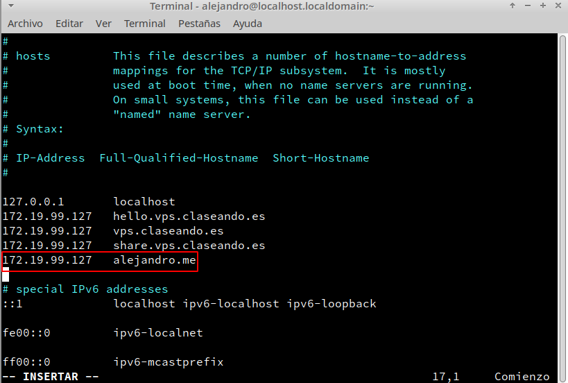
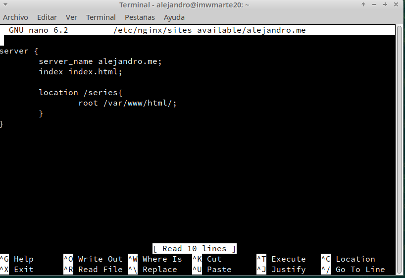
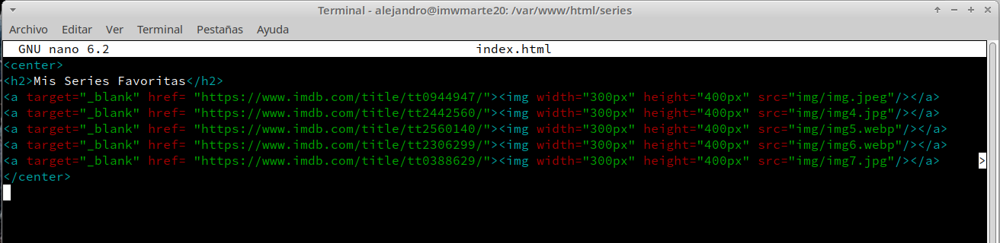
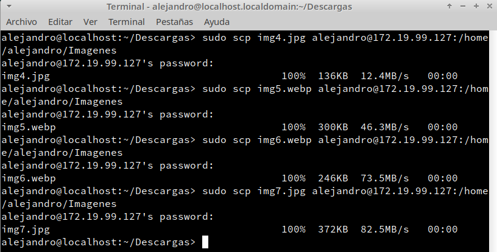
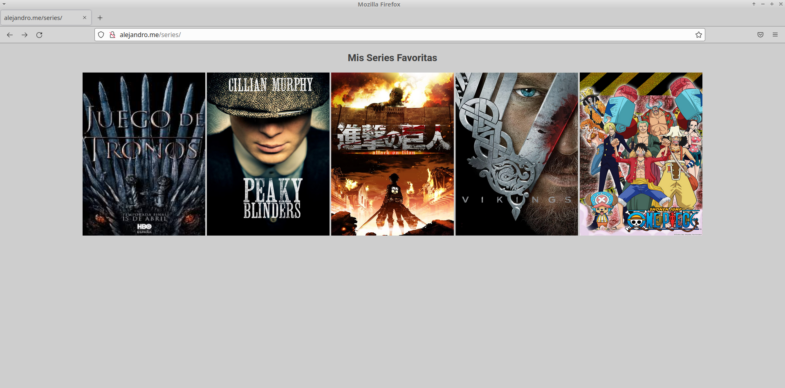

# UT1-A1: Mis series favoritas

## Introducción

Vamos a utilizar nginx para alojar una página web que muestre nuestras series favoritas. El nombre de la página será `alejandro.me` y nos mostrará las imágenes de las series al entrar en `alejandro.me/series/`.

---

## Desarrollo

Lo primero es añadir `alejandro.me` al fichero `/etc/hosts`, para facilitar el acceso a la web.

Una vez hecho eso, creamos la carpeta `/var/www/html/series` donde estará ubicado el index.html que mostrará nuestra página. A continuación, añadimos el virtualhost en el fichero `/etc/nginx/sites-available/alejandro.me` con la siguiente configuración:

**Explicación:**

* `server_name`: nombre del servidor o página web.
* `index`: fichero index.html que queremos que cargue, en este caso el index.html por defecto
* `location`: subdirectorios de nuestra web
+ `root`: ruta en la que se encuentra la información que vamos a mostrar/utilizar.

* Para que la configuración del fichero funcione, tendremos que crear un enlace simbólico al mismo en `/etc/nginx/sites-enabled` con el comando `ln -s`. 

Configuramos el index.html ubicado en `/var/www/html/series` de la siguiente forma:

> NOTA: Para pasar las imágenes al servidor, podemos descargarlas en la máquina cliente y utilizar el comando `scp`:  
      
Finalmente, reiniciamos el servicio nginx con `systemctl reload nginx.service` y accedemos a nuestra web:

---