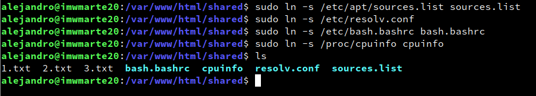
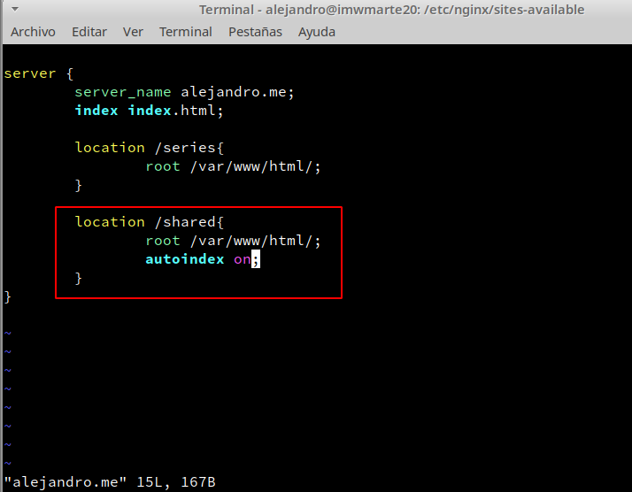
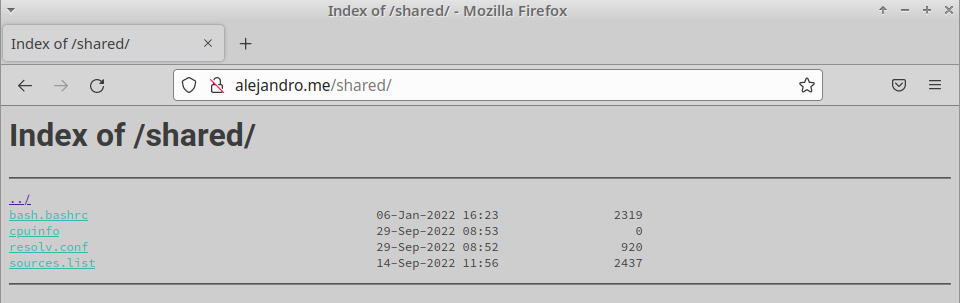

# UT1-A2: Listado de directorios

***Nombre:*** Alejandro de Paz Hernández

***Curso:*** 2º de Ciclo Superior de Administración de Sistemas Informáticos en Red.

## Introducción

Vamos a añadir el directorio `shared` a nuestra web `alejandro.me`. Este directorio mostrará una serie de ficheros que contienen información sobre nuestra máquina cliente.

## Desarrollo

Lo primero es crear la carpeta `/var/www/html/shared` donde estarán ubicados los ficheros que mostrará nuestra página. Utilizaremos enlaces simbólicos para "copiar" los archivos:

> NOTA: los ficheros *.txt son ficheros de prueba que se han eliminado posteriormente.

A continuación, añadimos la localización de `/shared` al virtualhost creado en la actividad anterior:

Por último, recargamos nginx con `systemctl reload nginx.service` y comprobamos entrando a la web:

