# UT1-A3: Trabajo con virtual hosts

## Introducción

Esta actividad vamos a configurar 4 sitios web o virtual hosts utilizando Nginx.

## Desarrollo

Empezamos añadiendo los nombres de los 4 sitios web en el fichero `/etc/hosts`:

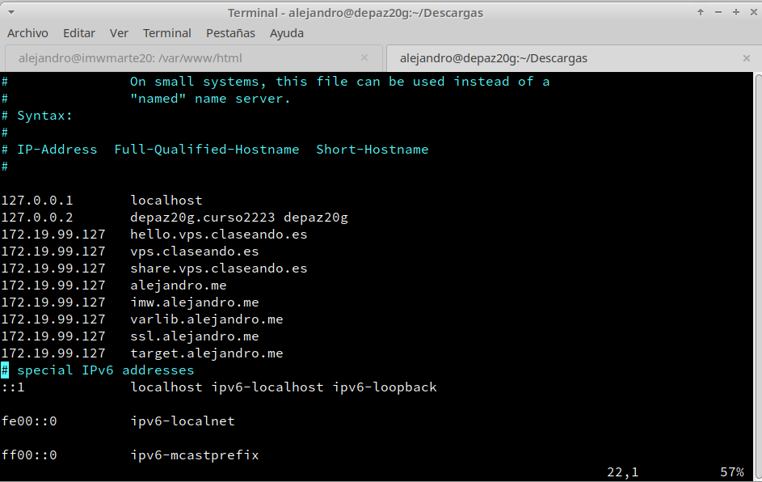

## Sitio web 1 - imw.alejandro.me

En esta primerá página web vamos a mostrar una imagen con el temario de la asignatura. Para ello, descargamos dicha imagen en la máquina cliente y la pasamos a la máquina servidor con el comando `scp`:

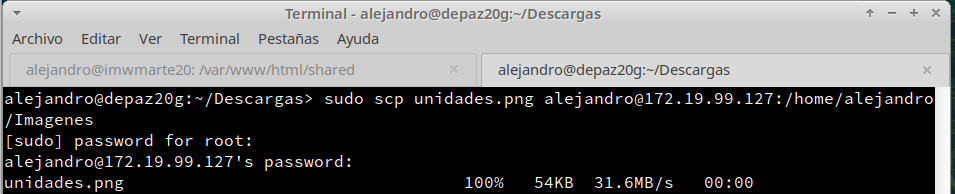

Creamos los directorios `/var/www/html/imw` y `/var/www/html/imw/img` y movemos la imagen descargada a este último.

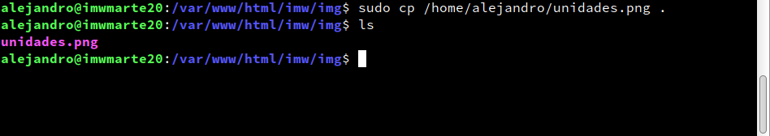

Creamos el index.html dentro de `/var/www/html/imw`:

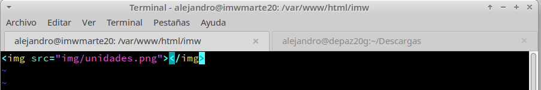

Por último, configuramos el virtualhost `imw.alejandro.me` dentro de `/etc/nginx/sites-available` y añadimos un enlace simbólico en `/etc/nginx/sites-enabled`:

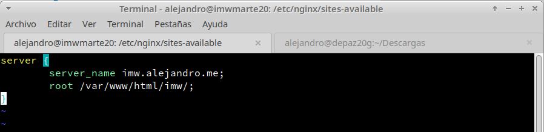

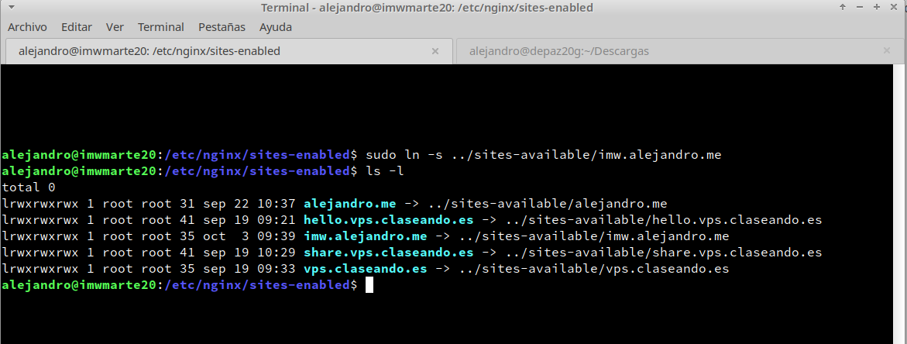

Reiniciamos nginx y comprobamos que funciona:

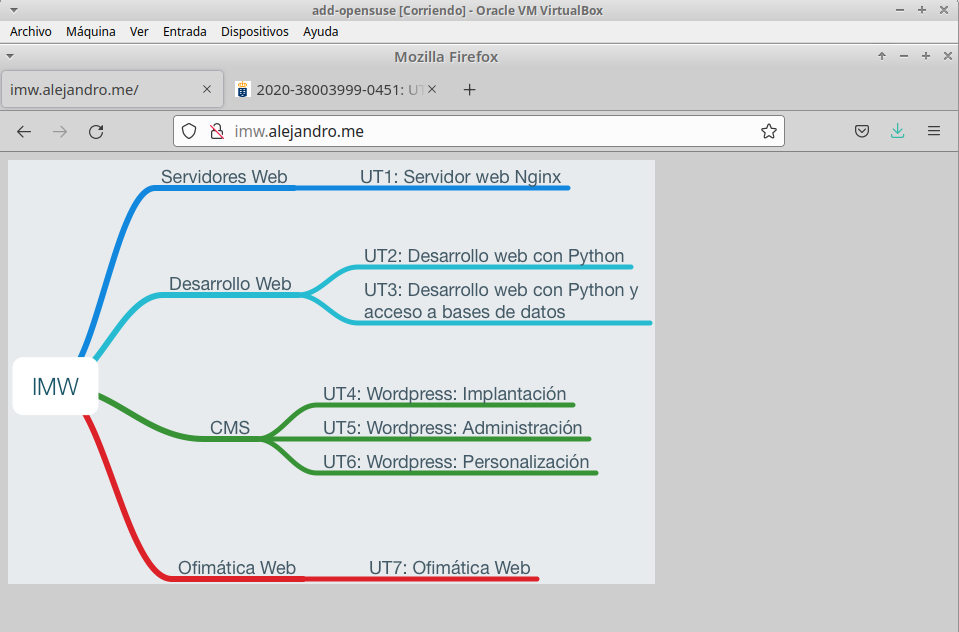

Una vez configurado el virtual host, vamos a añadir un subdirectorio llamado `/mec` que muestre un enlace al Real decreto del título de Administración de Sistemas Informáticos en Red - MEC. Para ello, creamos el directorio `/var/www/html/imw/mec` y creamos un index.html dentro con el siguiente contenido:

```
<a href="https://www.boe.es/buscar/doc.php?id=BOE-A-2009-18355">Enlace al Real Decreto</a>

```

## Sitio web 2 - varlib.alejandro.me

En este segundo virtual host vamos a mostrar el listado de ficheros y directorios de `/var/lib/` de la máquina servidor. Además, tendremos que utilizar el puerto 9000. Para ello, creamos el virtual host con los siguientes parámetros (para facilitar las cosas, definiremos como root el propio directorio `/var/lib/`):

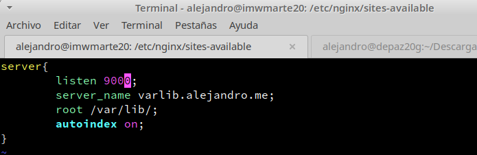

**Explicación:**

* `listen`: puerto por el que el virtual host escuchará las peticiones.

Comprobamos accediendo a la web:

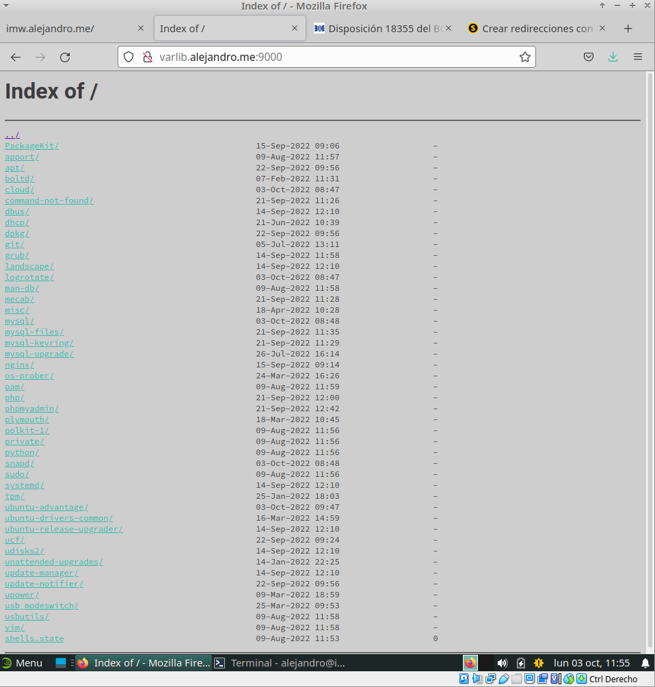

## Sitio web 3 - ssl.alejandro.me

Vamos a crear un virtual host con un nivel de seguridad superior a los anteriores, añadiendo un sistema de autenticación para poder acceder al mismo.

Lo primero es crear las credenciales para acceder a la web. Empezamos creando una contraseña y encriptándola con el comando `crypt`:

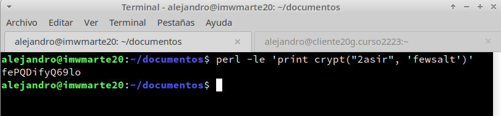

**Explicación:**

* `Perl` es un lenguaje de programación y su función aquí es mostrarnos el resultado del comando `crypt`. 
* Encriptamos la contraseña "2asir" utilizando el algoritmo "fewsalt"

Copiamos el resultado del comando anterior y lo pegamos en el fichero `.htpasswd`, que crearemos a continuación. En este fichero introduciremos el nombre de usuario y la contraseña de la siguiente forma:

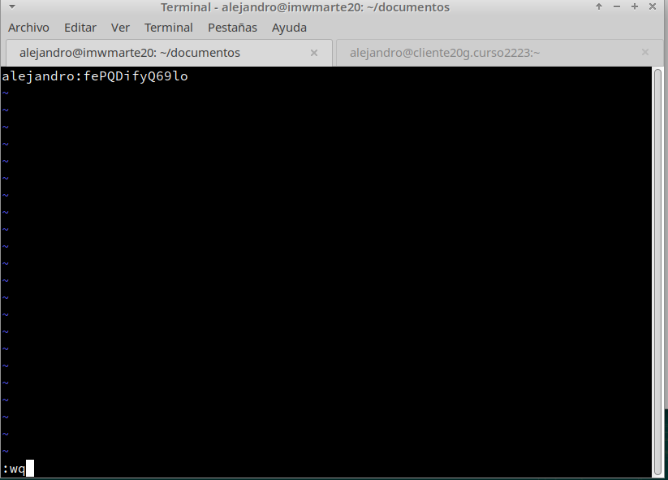

En este virtual host mostraremos un listado del alumnado de clase al acceder al subdirectorio `/students`. Por tanto, creamos la carpeta `/var/www/html/students` y el fichero `/var/www/html/students/index.html` con dicho listado. Por último, configuramos el virtual host en `/etc/nginx/sites-available` y creamos el enlace simbólico en `/etc/nginx/sites-enabled`:

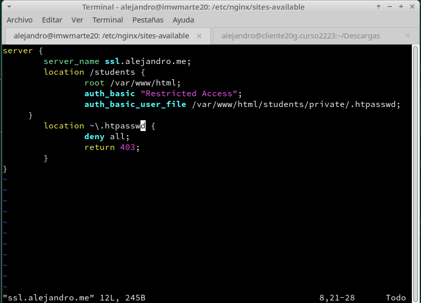

**Explicación:**

* `auth_basic`: es el mensaje que mostraremos al usuario al pedirle la autenticación. En este caso utilizamos un mensaje por defecto de Nginx.
* `auth_basic_user_file`: indicamos la ruta del fichero donde se encuentran las credenciales válidas.
* En este caso, hemos denegado al acceso al fichero `.htpasswd`, ya que es el que contiene las credenciales. Para ello, utilizamos la sentencia `deny` para denegar cualquier petición de descarga o apertura del archivo y `return` para elegir el mensaje de error a mostrar.

Finalmente, nuestra web quedaría de la siguiente forma:

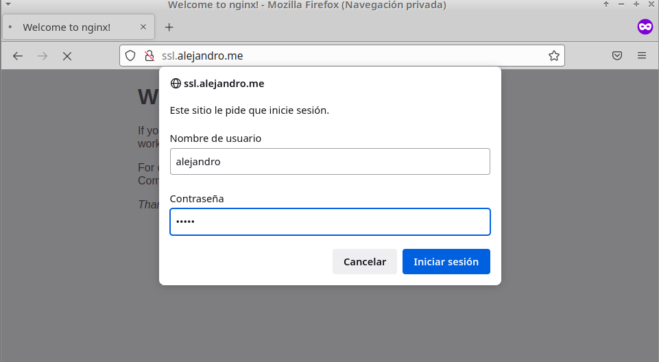

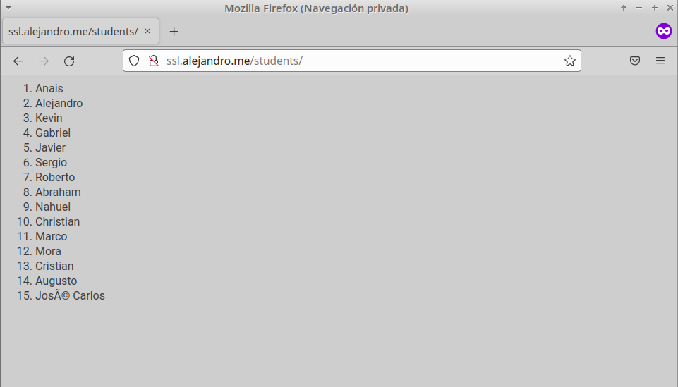


## Sitio web 4 - redirect.alejandro.me

Para este último virtual host vamos a configurar una redirección. Redirigiremos todas las peticiones que se hagan a `http://redirect.alejandro.me` a `http://target.alejandro.me`. 

Para ello, configuramos el virtual host `redirect.alejandro.me` de la siguiente forma:

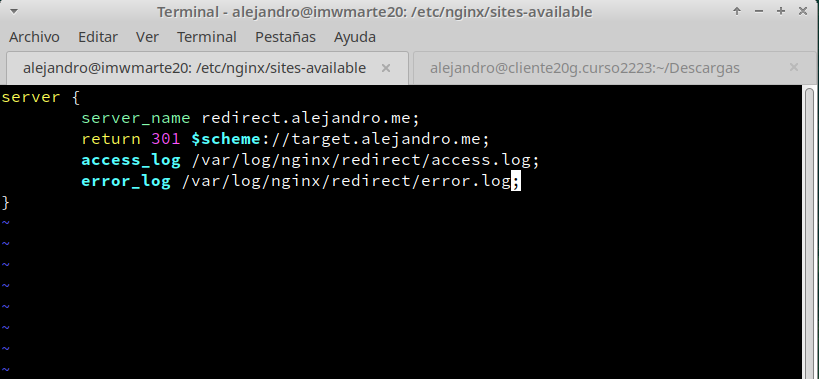

**Explicación:**

* `return 301`: lo utilizamos para realizar una redirección de una web a otra. Simplemente indicamos la web a la que queremos redirigir. `$scheme` lee el protocolo (HTTP, HTTPS...) que se está usando en la dirección original y lo copia.
* `access_log`: redirigimos al fichero en el que queremos que se guarde el registro de acceso.
* `error_log`: redirigimos al fichero en el que queremos que se guarde el registro de errores.

La página `target.alejandro.me` deberá mostrar la página web adjuntada, por lo que la descargamos en la máquina cliente, la copiamos en la máquina servidor y descomprimimos el archivo .zip en `/var/www/html/`. Acto seguido, creamos el archivo de configuración del virtual host `target.alejandro.me`:

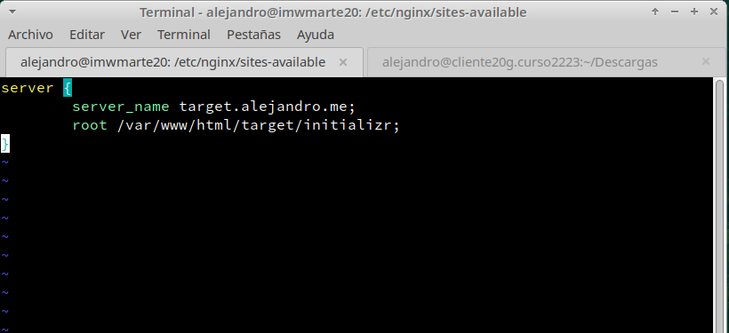

Entramos en la página y comprobamos:

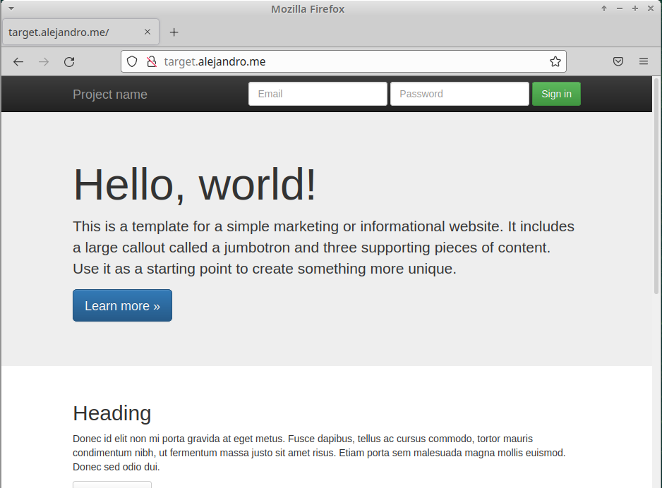
